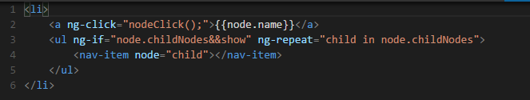
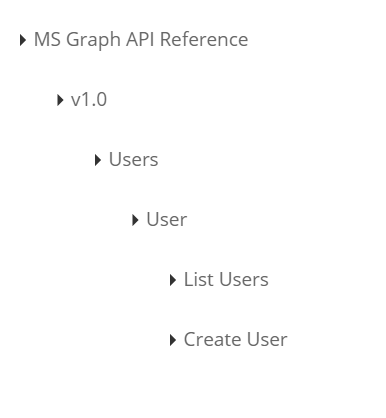

# recursive-ng-directive
Recursive angular directive is a simple angular example of how to use a recursive directive to render menu items

##Data structure 
For simplicity we are using a simple json file to represent the menu items, each item will be represented by a **node** element which consists of 
1. Name
2. ChildNodes(array of nodes)

##Directive
The directive is a simple directive that renders the current node as an HTML anchor and if there is child nodes it render it as unorder list
in the directive template we define the directive as a child element adding a recursive nature to it

when the leaf nodes are clicked an event will be published using the $rootScope.$emit so it can be easily handled by any other components listen to the same event type
##How it will look like   

